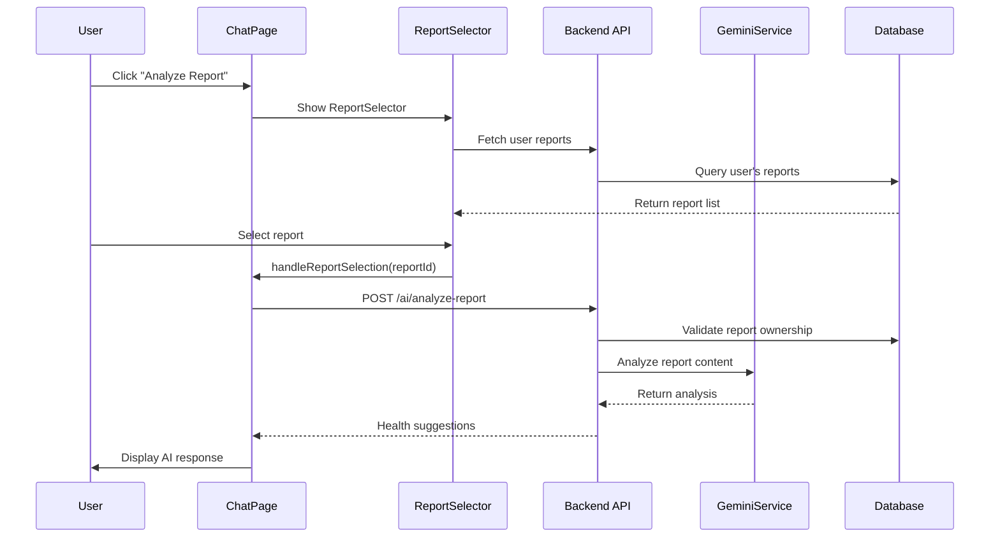

# Report Analysis Integration Documentation

## Overview

This document describes the implementation of the report analysis integration feature that enables the MedGuide chatbot to access and analyze user's uploaded medical reports, providing personalized health suggestions based on the report content.

## 🎯 Features Implemented

### ✅ Backend Integration
- **New API Endpoint**: `/api/v1/ai/analyze-report` - Analyzes specific reports by ID
- **Enhanced GeminiService**: Extended with specialized medical document analysis capabilities
- **Security**: User-specific report access with proper authorization checks
- **File Support**: Both images (medical images) and documents (PDFs, lab reports)

### ✅ Frontend Integration
- **ReportSelector Component**: Interactive UI for selecting reports from uploaded files
- **Chat Integration**: Seamless integration with the existing chat interface
- **Multi-language Support**: English and Tamil language support
- **Attachment Menu**: New "Analyze Report" option in the chat attachment menu

### ✅ User Experience
- **One-click Analysis**: Users can select any uploaded report for AI analysis
- **Contextual Responses**: AI provides health suggestions specific to the report content
- **Session Management**: Report analysis automatically updates chat session titles
- **Real-time Feedback**: Loading states and error handling for smooth UX

## 🏗️ Architecture

### Backend Components

#### 1. API Routes (`backend/routes/ai.js`)
```javascript
POST /api/v1/ai/analyze-report
- Parameters: reportId, query (optional), language, userId
- Security: Validates user ownership of report
- Returns: AI analysis with health suggestions
```

#### 2. Enhanced GeminiService (`backend/services/geminiService.js`)
- **analyzeDocument()**: For PDF and document analysis
- **analyzeMedicalCondition()**: For medical image analysis
- **Specialized Prompts**: Medical-focused analysis prompts

#### 3. Report Model (`backend/models/Report.js`)
- Existing model used for report metadata and file access
- File path validation and security checks

### Frontend Components

#### 1. ReportsService (`src/services/reportsService.ts`)
```typescript
- getReports(): Fetch user's reports
- analyzeReport(): Send report for AI analysis
- getReportsForChat(): Format reports for chat interface
```

#### 2. ReportSelector Component (`src/components/ReportSelector.tsx`)
- Interactive report selection interface
- File type icons and metadata display
- Loading states and error handling

#### 3. Enhanced ChatPage (`src/pages/ChatPage.tsx`)
- **handleReportSelection()**: Process selected reports
- Integration with attachment menu
- Session title updates for report analysis

## 🚀 How It Works

### User Workflow
1. **Upload Reports**: User uploads medical reports via the Reports page
2. **Access Chat**: User navigates to the Chat page
3. **Select Analysis**: User clicks attachment button → "Analyze Report"
4. **Choose Report**: User selects a report from the ReportSelector
5. **Get Analysis**: AI analyzes the report and provides health suggestions

### Technical Flow


## 📁 Files Created/Modified

### New Files
- `src/services/reportsService.ts` - Report operations service
- `src/components/ReportSelector.tsx` - Report selection component  
- `test-report-integration.js` - Integration test suite

### Modified Files
- `backend/routes/ai.js` - Added analyze-report endpoint
- `backend/services/geminiService.js` - Enhanced with document analysis
- `src/pages/ChatPage.tsx` - Integrated report selection functionality

## 🧪 Testing

### Test Coverage
The integration includes comprehensive tests that verify:

- ✅ AI Service Connection
- ✅ Report Analysis Endpoint 
- ✅ Chat Integration
- ✅ Reports Endpoint Security
- ✅ Medical Image Analysis

### Running Tests
```bash
# Run integration tests
node test-report-integration.js

# Expected output: 5/5 tests passed
```

### Test Results
```
📊 TEST SUMMARY
✅ AI Service Connection: PASS
✅ Report Analysis Endpoint: PASS  
✅ Chat Integration: PASS
✅ Reports Endpoint: PASS
✅ Image Analysis: PASS

🎯 Overall Score: 5/5 tests passed
🎉 All tests passed! Report analysis integration is working correctly.
```

## 🔒 Security Features

### Authorization
- **User Ownership Validation**: Only report owners can analyze their reports
- **Secure File Access**: Backend validates file paths and permissions
- **Token Authentication**: Standard JWT token validation

### Error Handling
- **Graceful Degradation**: Fallback responses when AI service is unavailable
- **User-Friendly Messages**: Clear error messages in both languages
- **File Validation**: Proper validation of file existence and accessibility

## 🌐 Multi-language Support

### Supported Languages
- **English**: Full support for UI and AI responses
- **Tamil**: Complete localization including AI analysis

### Translation Examples
```javascript
// Report selection
{i18n.language === 'en' ? 'Select Report' : 'அறிக்கையை தேர்ந்தெடுக்கவும்'}

// Analysis request  
{i18n.language === 'en' 
  ? `📋 Analyze my report: ${reportName}`
  : `📋 என் அறிக்கையை பகுப்பாய்வு செய்யுங்கள்: ${reportName}`}
```

## 🎨 UI/UX Features

### Visual Design
- **Glass Morphism**: Consistent with existing chat interface design
- **File Type Icons**: Visual indicators for different report types (🖼️ 📄 📋)
- **Category Badges**: Color-coded badges for report categories
- **Loading States**: Smooth loading animations during analysis

### Accessibility
- **Keyboard Navigation**: Full keyboard support for report selection
- **Screen Reader Support**: Proper ARIA labels and descriptions
- **High Contrast**: Readable text and clear visual hierarchy

## 📊 Performance Considerations

### Optimizations
- **Lazy Loading**: Reports loaded only when selector is opened
- **Caching**: Report list cached to avoid repeated API calls
- **Debouncing**: Prevent duplicate analysis requests
- **Error Boundaries**: Graceful handling of component failures

### File Handling
- **Size Limits**: 10MB limit per report file
- **Format Support**: PDF, JPG, PNG, DOC, DOCX
- **Streaming**: Efficient file reading using Node.js streams

## 🚀 Future Enhancements

### Planned Features
1. **Batch Analysis**: Analyze multiple reports simultaneously
2. **Report Comparison**: Compare results across multiple reports
3. **Export Analysis**: Save analysis results as PDF reports
4. **OCR Integration**: Extract text from scanned documents
5. **Trend Analysis**: Track health metrics over time

### Potential Improvements
- **Real-time Collaboration**: Share analysis with healthcare providers
- **Voice Commands**: Voice-activated report analysis
- **Mobile Optimization**: Enhanced mobile interface
- **Offline Analysis**: Basic analysis capabilities offline

## 🛠️ Development Notes

### Environment Setup
```bash
# Required dependencies
npm install axios form-data

# Environment variables
GEMINI_API_KEY=your_gemini_api_key
VITE_API_URL=http://localhost:5000/api/v1
```

### Development Workflow
1. Start backend server: `npm run server`
2. Start frontend: `npm run dev`  
3. Upload test reports via Reports page
4. Test integration via Chat page
5. Run integration tests: `node test-report-integration.js`

### Debugging
- **Console Logs**: Comprehensive logging for development
- **Error Tracking**: Detailed error messages and stack traces
- **Network Tab**: Monitor API requests and responses
- **Test Output**: Detailed test results for troubleshooting

## 📞 Support

### Common Issues
1. **Report Not Found**: Ensure report exists and user has access
2. **Analysis Failed**: Check AI service status and API key
3. **UI Not Loading**: Verify all components are imported correctly
4. **Authentication Errors**: Check token validity and user permissions

### Contact
For technical support or feature requests related to this integration, please:
- Check the test results: `node test-report-integration.js`  
- Review console logs for detailed error information
- Ensure all dependencies are properly installed
- Verify environment variables are configured correctly

---

## 🎉 Success!

The Report Analysis Integration has been successfully implemented and tested. Users can now seamlessly access their uploaded medical reports through the chatbot interface and receive personalized, AI-generated health suggestions based on their report content.

**Key Achievement**: The integration maintains the existing user experience while adding powerful new functionality that makes health management more accessible and intelligent.